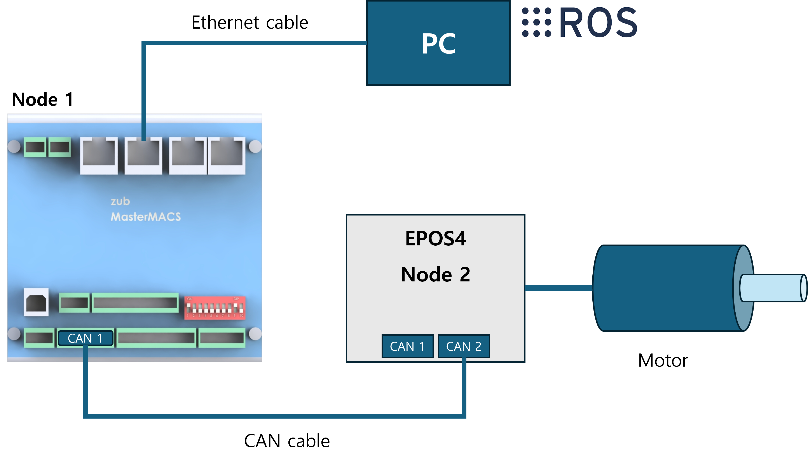

# motor_control_pkg

## 1. Purpose

Iplement socket communication between personal computer and zub MasterMACS.

Herein, zub MasterMACS and PC are in charge of server and client, respectively.

## 2. How to wire zub MasterMACS and EPOS4 drive

## 3. Setup PC in linux
