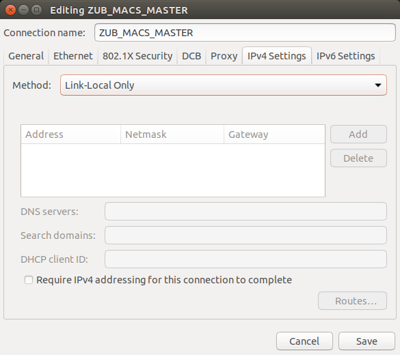
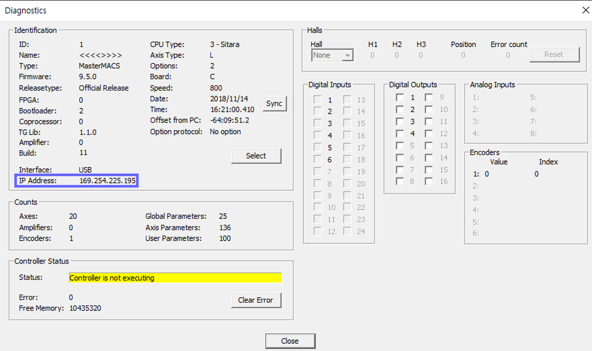

# motor_control_pkg

## 1. Purpose
Iplement socket communication between personal computer and zub MasterMACS.

Herein, zub MasterMACS and PC are in charge of server and client, respectively.

## 2. How to wire zub MasterMACS and EPOS4 drive


## 3. Setup for PC in linux

Go to ethernet and set the wired connection as Link-Local Only in IPv4 settings.



## 4. Setup for ROS launch file
The ip address and port of zub MasterMACS should be found out.

How to get ip address of zub MasterMACS

Go to ApossIDE

Click controller tab and then Diagnostics.



In the motor_bringup.launch, set the ip address and port.

Also, you should designate the mode (position or torque).

## 5. How to execute the node


```
roslaunch motor_control motor_bringup.launch
```

To run the motor, publish the topic named "target" as the following:

```
rostopic pub /target_pos motor_control_msg/target_pos_value "stamp:
    secs: 0
    nsecs: 0
  target_pos: 14800"
```

To see the motor data (torque, position, and velocity),
```
rostopic echo /actual
```
